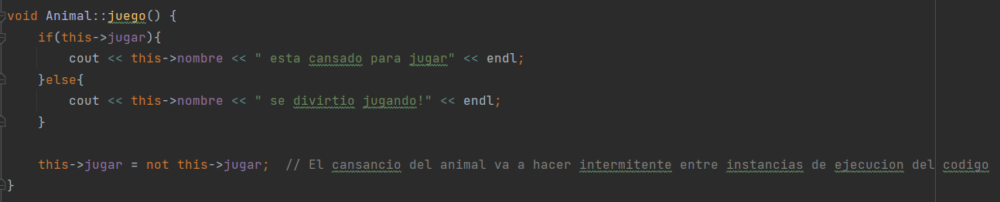

# sistemaZoo
Este es el SendoZoo un programa que emula el funcionamiento de un zoológico. El proyecto consta de tres clases: "Zoo", "Habitat" y "Animal", que trabajan juntas para crear y gestionar el zoológico virtual. Con este, podrás agregar hábitats, añadir animales a los hábitats, listar los hábitats y animales existentes, permitir que los animales realicen acciones y editar las dietas de los animales.

#Clase Animal:
La clase "Animal" tiene un constructor con parámetros que permite establecer los valores iniciales de los atributos del animal al momento de crear un objeto. También tiene un constructor por defecto que no recibe parámetros y se inicializa con los valores por defecto de los atributos.
Además de los constructores, se tienen los getters de algunos atributos de la clase, los setters no son necesarios pues la inicialización se hace con el constructor por parámetros y los atributos que cambian lo hacen por medio de los otros métodos públicos.
Además, tiene un método "comer()" que toma un alimento como parámetro y verifica si está presente en la dieta del animal mediante un booleano que se ingresa como argumento.
Por último, se tienen 3 métodos que corresponden a las acciones del animal:
##Metodo juego:
En primer lugar se tiene juego() que no recibe ningún parámetro, lo que hace es imprimir un mensaje dependiendo del valor del atributo jugar que es un booleano, luego de imprimir el mensaje el valor de jugar cambia a su contrario para que en la siguiente instancia se imprima el otro el mensaje, esto para que la función sea intermitente entre instancias de ejecución.

