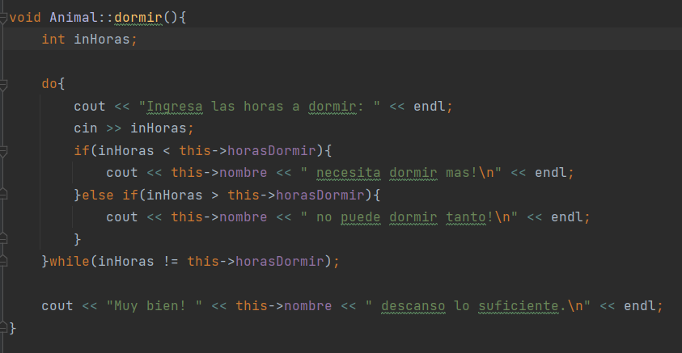
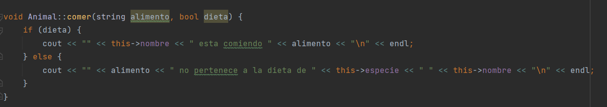

# sistemaZoo 🐾
Este es el SendoZoo un programa que emula el funcionamiento de un zoológico. El proyecto consta de tres clases: "Zoo", "Habitat" y "Animal", que trabajan juntas para crear y gestionar el zoológico virtual. Con este, podrás agregar hábitats, añadir animales a los hábitats, listar los hábitats y animales existentes, permitir que los animales realicen acciones y editar las dietas de los animales.

[-> Diagrama de clases](https://drive.google.com/file/d/1UYupBgwovA_6dGpFyANumDh280z5BzWh/view?usp=sharing)

# Clase Animal:

La clase "Animal" tiene un constructor con parámetros que permite establecer los valores iniciales de los atributos del animal al momento de crear un objeto. También tiene un constructor por defecto que no recibe parámetros y se inicializa con los valores por defecto de los atributos.
Además de los constructores, se tienen los getters de algunos atributos de la clase, los setters no son necesarios pues la inicialización se hace con el constructor por parámetros y los atributos que cambian lo hacen por medio de los otros métodos públicos.
Además, tiene un método "comer()" que toma un alimento como parámetro y verifica si está presente en la dieta del animal mediante un booleano que se ingresa como argumento.
Por último, se tienen 3 métodos que corresponden a las acciones del animal:

## Metodo juego:

En primer lugar se tiene juego() que no recibe ningún parámetro, lo que hace es imprimir un mensaje dependiendo del valor del atributo jugar que es un booleano, luego de imprimir el mensaje el valor de jugar cambia a su contrario para que en la siguiente instancia se imprima el otro el mensaje, esto para que la función sea intermitente entre instancias de ejecución.

## Metodo dormir:

Luego se tiene dormir() que solicita al usuario que ingrese la cantidad de horas que el animal debe dormir y luego compara esa cantidad con las horas de sueño establecidas para el animal en el atributo "horasDormir".

Si la cantidad ingresada es menor a las horas de sueño necesarias del animal, se muestra un mensaje indicando que el animal necesita dormir más. Si la cantidad ingresada es mayor a las horas de sueño necesarias del animal, se muestra un mensaje indicando que el animal no puede dormir tanto.

El bucle se repite hasta que el usuario ingrese la cantidad correcta de horas de sueño necesarias para el animal, una vez que se ingresa la cantidad correcta, se muestra un mensaje indicando que el animal ha descansado lo suficiente.

## Metodo comer:

Por último la función comer(), que toma una cadena alimento como parámetro y verifica si está presente en la dieta del animal mediante un booleano que se ingresa como argumento. Si dieta es verdadero, muestra un mensaje indicando que el animal está comiendo el alimento especificado. Si dieta es falso, muestra un mensaje indicando que el alimento especificado no pertenece a la dieta del animal. En resumen, el método "comer()" en la clase "Animal" verifica si un alimento está permitido en la dieta del animal y muestra mensajes adecuados en función de esa verificación.

# Clase Habitat:

La clase consta de 3 atributos privados: nombre, tipo (tipo de hábitat) y un mapa de los animales que contiene. Las claves del mapa corresponden al id de cada animal y el valor es el puntero al objeto Animal. Además de los getters se tiene un método para agregar animales y otro para imprimir los animales registrados.

# Clase Zoo:

La clase Zoo es la encargada de gestionar los hábitats, el id de los animales y las dietas. Los hábitats son almacenados en un vector, mientras que las dietas se almacenan en un diccionario donde las claves son el tipo de dieta (Carnívoro, Herbívoro u Omnívoro) y los valores son vectores que contienen los alimentos permitidos para cada dieta. Esta clase también tiene los métodos para editar las dietas.

# Pruebas

## Menú
Al ejecutar el programa se despliega un menú con 5 opciones, entre las que están Salir, Añadir hábitat, Añadir animal, Listar hábitats y sus animales, Realizar acción (Dar una orden a algún animal), y Editar dietas (agregar y eliminar alimentos).

0) Salir: esta opción termina con la ejecución del programa.

1) Añadir hábitat: pregunta el nombre y el tipo de hábitat para agregarlo al vector de la clase Zoo. Con el debugger es posible verlo fácilmente.

2) Añadir animal: Pregunta al usuario los atributos del animal como especie, nombre, tipo de hábitat, etc., y el hábitat al que lo queremos agregar, y le asigna un ID único automáticamente. Este objeto de la clase Animal lo agrega al mapa del hábitat que seleccionemos, en el que la llave es el ID del animal.

3) Listar Hábitats y animales: recorre el vector de la clase Zoo, accede a cada Hábitat del vector y va imprimiendo la información de cada animal que esté contenido en el mapa de aquel hábitat.

4) Realizar Acción: imprime los animales del hábitat y le pide al usuario el ID del animal al que le quiere dar la orden, en donde tiene las opciones de comer, dormir y jugar. Si selecciona comer pide el ID del animal, verifica que el vector de la dieta no esté vacío, pide el nombre del alimento, verifica que exista y posteriormente come. Si selecciona Dormir, pide el ID, y pide la cantidad de horas, si ingresa más o menos de las necesarias vuelve a pedir el dato. Si selecciona jugar, pide el ID y cambia el valor de este a true, por lo que si se vuelve a intentar, no será posible, e imprimirá que el animal está cansado.

### Prueba de Comer

### Prueba de jugar

### Prueba de dormir

5) Editar dietas: permite agregar y eliminar alimentos de los vectores de las distintas dietas, las cuales actúan como llaves de un mapa.

